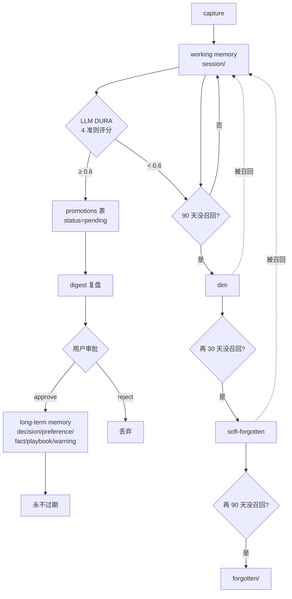

# 治理：让记忆库自己维护自己

## 治理为什么需要

工作记忆是 AI 自己说的，质量参差。如果不筛选直接进长期记忆，几次会话就把
画像污染光。memoryd 的治理子系统做四件事：

1. **DURA 评分** —— LLM 按 4 准则打分，过线才能进 promotion 队列
2. **decay 状态机** —— 长期不用的 session 自动 dim → soft-forgotten → forgotten
3. **digest 复盘** —— 每周（默认 Mon 09:00）汇总待审 + 重复 + 即将到期 + trends
4. **audit 审计链** —— 所有写操作记 JSONL，SHA256 prev_hash 链可篡改检测



## DURA 评分

源码：[memoryd/src/memoryd/governance/analyze.py](https://github.com/zhuzhen-team/memory-system/blob/main/memoryd/src/memoryd/governance/analyze.py)

```
D — Decision-worthy   有决策价值（不是闲聊摘要）
U — Useful in future  对未来有用
R — Recallable hooks  有具体可召回的钩子（人名/项目/时间）
A — Accurate          准确，不是 LLM 编出来的
```

每条 session 写完后，`capture` 自动 fork 一个 subprocess 跑 `memoryd analyze-session <slug>`：

```python
# 简化流程
session = load_session(slug)
resp = llm.generate_json(
    render_dura_prompt(session.body),
    schema=DURAOutput,
)
dura_score = {"D": resp.D, "U": resp.U, "R": resp.R, "A": resp.A}
mean = sum(dura_score.values()) / 4
if mean >= 0.6:
    insert_into_promotions(slug, dura_score, proposed_type, proposed_title, ...)
update_memory_dura(slug, dura_score)
```

LLM 不可用（没配 API key / 网络断）就跳过，capture 不阻塞；后续可手工跑 `memoryd analyze-session <slug>` 重试。

## decay 衰减状态机

源码：[memoryd/src/memoryd/governance/decay.py](https://github.com/zhuzhen-team/memory-system/blob/main/memoryd/src/memoryd/governance/decay.py)

| 阈值 | 转换 |
|---|---|
| `alive` 90 天无召回 | → `dim` |
| `dim` 30 天无召回 | → `soft-forgotten`（默认 search 不返回） |
| `soft-forgotten` 90 天无召回 | 物理迁到 `forgotten/`，删 SQLite 行 |

被召回（search / `mem_get` 命中）会把状态拉回 `alive` 并刷新 `last_recalled_at`。

cron 每天 03:00 跑 `memoryd decay-sweep`，手动执行：

```bash
memoryd decay-sweep
```

仅 `session` 类型会衰减；`decision/preference/fact/playbook/warning` ttl 默认 ∞。

## digest 复盘

源码：[memoryd/src/memoryd/governance/digest.py](https://github.com/zhuzhen-team/memory-system/blob/main/memoryd/src/memoryd/governance/digest.py)

```bash
memoryd digest             # 文本视图（默认）
memoryd digest --json      # JSON（脚本用）
memoryd digest --notify    # 同时弹原生通知 + SMTP 邮件
memoryd digest --tui       # 启动 textual 交互界面
```

三栏：

- **候选提升**：DURA ≥ 0.6 的 LLM 推荐 (pending promotions)
- **重复合并**：fingerprint 相同的条目对
- **TTL 到期**：进 dim / soft-forgotten 的提醒

新增 **trends 栏**（profile 模块写入）：

```
=== Trends (last 7 days) ===

Top triggers:
  memory-system    27 hits
  knowledge-graph  12 hits
  identity         9 hits

Top entities (rising):
  Solid             +17 mentions
  memory-system     +45 mentions

Recent supersedes:
  preference#react → preference#solid

Recall hot:
  decision#feedback-autonomous-chinese  recalled 12 times this week
```

源码：[memoryd/src/memoryd/profile/trends.py](https://github.com/zhuzhen-team/memory-system/blob/main/memoryd/src/memoryd/profile/trends.py)（`render_trends_section`）

## 审批

```bash
memoryd digest --json      # 拿 promotion_id
memoryd promote <id>       # 批准 → 真写 decision/preference/...md 文件
```

`promote` 不只是 SQLite status=approved，还真把 `proposed_body / proposed_type / proposed_triggers` 写到
`scopes/<hash>/<type>s/promoted-<id>-<slug>.md`，含 `promoted_from` 字段标 source session。

## 合并去重

```bash
memoryd merge --keep <good-slug> --drop <bad-slug-1> <bad-slug-2>
```

源码：[memoryd/src/memoryd/governance/merge.py](https://github.com/zhuzhen-team/memory-system/blob/main/memoryd/src/memoryd/governance/merge.py)

`--keep` 保留，`--drop` 删除（连带 audit row）。被合并的条目以 audit `merge` 事件记录。

## audit 审计链

源码：[memoryd/src/memoryd/governance/audit.py](https://github.com/zhuzhen-team/memory-system/blob/main/memoryd/src/memoryd/governance/audit.py)

```bash
memoryd audit                                      # 全部事件
memoryd audit --scope=<hash>                       # 按 scope
memoryd audit --since=2026-05-01T00:00:00+00:00    # 时间窗
memoryd audit --event-type=access_denied
memoryd audit --json
```

`~/.local/share/memoryd/audit/audit.jsonl` 一行一事件：

```json
{"seq":42, "ts":"2026-05-18T22:30:12Z", "actor":"cli", "event_type":"capture",
 "scope_hash":"d8e86b48589e", "target_id":"2026-05-18-...",
 "details":"{...}",
 "prev_hash":"sha256:abc...", "this_hash":"sha256:def..."}
```

`this_hash = sha256(prev_hash || canonical_json(this_record_without_hash))`，
篡改单行会让后面所有行的链断掉。

## sensitive scope 授权（gate）

源码：[memoryd/src/memoryd/governance/gate.py](https://github.com/zhuzhen-team/memory-system/blob/main/memoryd/src/memoryd/governance/gate.py)

任何工具（CLI / MCP / Web）读敏感作用域前必须先 `gate.check_or_raise(scope_hash)`。
没 grant 抛 `AuthorizationRequired`，调用方决定是 raise 还是返回友好降级。

```bash
memoryd grant ~/scopes/finance --duration once     # 90 秒
memoryd grant ~/scopes/finance --duration session  # 8 小时
memoryd grant ~/scopes/finance --duration task --task my-deep-work
memoryd revoke ~/scopes/finance --task my-deep-work
```

授权状态存 `~/.local/share/memoryd/grants/`，**不进**同步盘。

详见 [加密](../operations/encryption.md)。

## cron 编排

`memoryd setup auto-install` 默认装：

- `memoryd decay-sweep` —— 每日 03:00
- `memoryd digest --notify` —— 每周一 09:00
- `memoryd profile rewrite-identity-weekly` —— 每周日 02:00（需 LLM 配好）
- `memoryd profile generate-monthly-report` —— 每月 1 日 04:00（需 LLM 配好）

详见 [定时任务](../operations/cron.md)。

## LLM provider 配置

`~/.config/memoryd/config.toml`：

```toml
[llm]
provider = "anthropic"    # anthropic / openai / ollama
model    = "claude-haiku-4-5"

[llm.anthropic]
api_key_env = "ANTHROPIC_API_KEY"

[llm.openai]
api_key_env = "OPENAI_API_KEY"
base_url    = "https://api.openai.com/v1"

[llm.ollama]
base_url = "http://127.0.0.1:11434"
```

源码：

- [memoryd/src/memoryd/llm/factory.py](https://github.com/zhuzhen-team/memory-system/blob/main/memoryd/src/memoryd/llm/factory.py)
- [memoryd/src/memoryd/llm/anthropic_provider.py](https://github.com/zhuzhen-team/memory-system/blob/main/memoryd/src/memoryd/llm/anthropic_provider.py)
- [memoryd/src/memoryd/llm/openai_provider.py](https://github.com/zhuzhen-team/memory-system/blob/main/memoryd/src/memoryd/llm/openai_provider.py)
- [memoryd/src/memoryd/llm/ollama_provider.py](https://github.com/zhuzhen-team/memory-system/blob/main/memoryd/src/memoryd/llm/ollama_provider.py)

prompt 模板在 [memoryd/src/memoryd/llm/prompts/](https://github.com/zhuzhen-team/memory-system/tree/main/memoryd/src/memoryd/llm/prompts)：

- `extract_entities.py` —— 实体抽取
- `judge_supersedes.py` —— supersede 判定
- `rewrite_identity.py` —— weekly identity 重写
- `profile_change_report.py` —— 月度变化报告

老的 DURA prompt 在 [memoryd/src/memoryd/prompts/dura_extract.txt](https://github.com/zhuzhen-team/memory-system/blob/main/memoryd/src/memoryd/prompts/dura_extract.txt)（Plan 3 遗留）。
