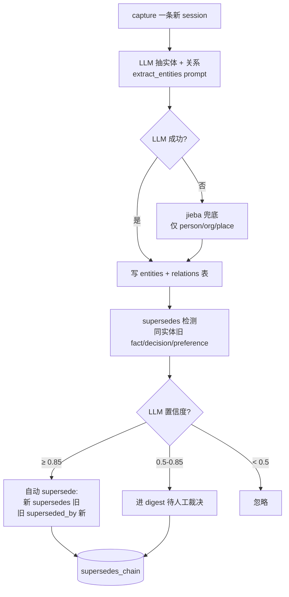

# 知识图谱：让记忆从条目堆变成图

## 为什么需要

只有"记忆条目"没有"实体"的话：

- 提到 "React" 100 次都是平行条目，系统不知道这 100 条都说的是同一个东西
- 用户偏好从 React 切到 Solid 这一**事实变化**，没人记录
- 召回时只能按关键词匹配，不能"找出与 React 相关的所有决策"

引入 **entity + relation** 后，记忆系统从"条目堆"升级成"图"，每条记忆是图的一条边或节点的属性。

## 数据流



源码：[memoryd/src/memoryd/knowledge_graph/](https://github.com/zhuzhen-team/memory-system/tree/main/memoryd/src/memoryd/knowledge_graph)

## entity 类型（7 类）

源码常量：[knowledge_graph/store.py](https://github.com/zhuzhen-team/memory-system/blob/main/memoryd/src/memoryd/knowledge_graph/store.py)（`ENTITY_TYPES`）

| type | 例子 |
|---|---|
| `person` | "user", "abble", "Anthropic" |
| `organization` | "zhuzhen-team", "Anthropic" |
| `place` | "深圳龙岗", "大运 5 栋 802" |
| `library` | "React", "Solid", "FastAPI", "pymilvus" |
| `tool` | "Claude Code", "Codex", "OpenClaw" |
| `project` | "memory-system", "wolin-clients-gathering" |
| `concept` | "DURA 评分", "decay 算法" |

entity_id 格式：`entity:<type>:<slug(name)>`，例如 `entity:library:React`。

## relation predicate（11 种）

源码常量：[knowledge_graph/store.py](https://github.com/zhuzhen-team/memory-system/blob/main/memoryd/src/memoryd/knowledge_graph/store.py)（`ALLOWED_PREDICATES`）

| predicate | 典型用法 |
|---|---|
| `mentions` | session → entity：被提到 |
| `works_on` | person → project |
| `uses` | person → library/tool |
| `prefers` | person → library |
| `supersedes` / `superseded_by` | memory ↔ memory：事实演化 |
| `conflicts_with` | memory ↔ memory：内容冲突待人工裁决 |
| `cites` | memory → memory：上下文引用 |
| `runs_on` | service → device |
| `belongs_to` | project → person/organization |
| `located_at` | person/device → place |

## SQLite 三表

完整 schema：[migrations/004_knowledge_graph.sql](https://github.com/zhuzhen-team/memory-system/blob/main/memoryd/src/memoryd/migrations/004_knowledge_graph.sql)

```sql
CREATE TABLE entities (
  id              TEXT PRIMARY KEY,                  -- entity:person:abble
  name            TEXT NOT NULL,
  type            TEXT NOT NULL CHECK(type IN ('person','organization','place',
                                                'library','tool','project','concept')),
  aliases         TEXT,                              -- JSON array
  context         TEXT,                              -- 最近一次出现的上下文片段
  first_seen_at   TEXT NOT NULL,
  last_seen_at    TEXT NOT NULL,
  mention_count   INTEGER NOT NULL DEFAULT 1,
  scope_hash      TEXT,                              -- 首次出现的 scope
  decay_state     TEXT NOT NULL DEFAULT 'fresh'
);

CREATE TABLE relations (
  id                INTEGER PRIMARY KEY AUTOINCREMENT,
  subject_id        TEXT NOT NULL,
  subject_kind      TEXT NOT NULL CHECK(subject_kind IN ('entity','memory')),
  predicate         TEXT NOT NULL,
  object_id         TEXT NOT NULL,
  object_kind       TEXT NOT NULL CHECK(object_kind IN ('entity','memory')),
  source_memory_id  TEXT,
  scope_hash        TEXT,
  confidence        REAL,
  created_at        TEXT NOT NULL,
  superseded_at     TEXT,                            -- NULL = active
  UNIQUE(subject_id, predicate, object_id, source_memory_id)
);

CREATE TABLE supersedes_chain (
  newer_memory_id  TEXT NOT NULL,
  older_memory_id  TEXT NOT NULL,
  entity_id        TEXT,
  confidence       REAL NOT NULL,
  decided_at       TEXT NOT NULL,
  decided_by       TEXT NOT NULL,                    -- 'auto' / 'user' / 'digest'
  reason           TEXT,
  PRIMARY KEY(newer_memory_id, older_memory_id)
);
```

## LLM 抽取契约

源码：[memoryd/src/memoryd/knowledge_graph/extract.py](https://github.com/zhuzhen-team/memory-system/blob/main/memoryd/src/memoryd/knowledge_graph/extract.py)

prompt：[memoryd/src/memoryd/llm/prompts/extract_entities.py](https://github.com/zhuzhen-team/memory-system/blob/main/memoryd/src/memoryd/llm/prompts/extract_entities.py)

```python
from memoryd.llm.prompts import extract_entities, render_extract_prompt

result = await extract_entities_and_relations(
    text=memory_body,
    scope_hash=scope_hash,
    memory_id=slug,
)

# result schema:
# {
#   "entities": [
#     {"name": "abble", "type": "person",
#      "aliases": ["阿宝"], "context": "...", "confidence": 0.92},
#   ],
#   "relations": [
#     {"subject": {"name": "abble", "type": "person"},
#      "predicate": "works_on",
#      "object": {"name": "memory-system", "type": "project"},
#      "confidence": 0.85},
#   ]
# }
```

## 中文处理：LLM 为主 + jieba 兜底

mem0 上游硬编码 spaCy `en_core_web_sm` + NLTK WordNet，**对中文场景无效**。我们的实现：

1. **LLM 为主**：直接让 Claude / OpenAI / Ollama 抽实体（prompt 本地化为中文），中英文混合都能处理
2. **jieba 兜底**：LLM 不可用（无网络 / 无 API key / 调用异常）时退回 jieba 词性标注，仅产出 person / organization / place
3. **不引入 spaCy 英文模型**：节省 ~50MB 依赖，对中文用户无收益

`jieba` 在函数内 import，避免冷启动慢。

## supersedes 自动检测

源码：[memoryd/src/memoryd/knowledge_graph/supersedes.py](https://github.com/zhuzhen-team/memory-system/blob/main/memoryd/src/memoryd/knowledge_graph/supersedes.py)

prompt：[memoryd/src/memoryd/llm/prompts/judge_supersedes.py](https://github.com/zhuzhen-team/memory-system/blob/main/memoryd/src/memoryd/llm/prompts/judge_supersedes.py)

```python
async def detect_supersedes_for_new_memory(
    store: KnowledgeGraphStore,
    new_memory_id: str,
    entity_ids: list[str],
    *,
    scope_hash: str,
    new_memory_text: str,
) -> SupersedesResult:
    """
    1. 查 entities 表里同 entity 的所有旧 preference/decision/fact
    2. 喂 LLM 判定，每个 candidate 出 SupersedeJudgment
       (confidence, reason, type: supersedes/conflicts_with/none)
    3. 按 SUPERSEDE_AUTO_THRESHOLD / SUPERSEDE_REVIEW_THRESHOLD 分流:
       - auto:   ≥ 0.85 → 直接写 supersedes_chain + 更新 frontmatter
       - review: 0.5–0.85 → digest 候选
       - ignore: < 0.5
    """
```

阈值常量：`SUPERSEDE_AUTO_THRESHOLD = 0.85`，`SUPERSEDE_REVIEW_THRESHOLD = 0.5`。

## 图查询 API

源码：[memoryd/src/memoryd/knowledge_graph/query.py](https://github.com/zhuzhen-team/memory-system/blob/main/memoryd/src/memoryd/knowledge_graph/query.py)

```python
memories_about_entity(store, entity_id, types=None) -> list[Memory]
    # 找出所有提到这个实体的记忆

entity_neighborhood_summary(store, entity_id) -> dict
    # entity 的小卡片（邻居 + 最近 mentions + 关键关系）

n_hop_subgraph(store, entity_id, depth=2) -> Graph
    # 以这个实体为中心的 N 跳子图（用于 Dashboard 可视化）

to_cytoscape_elements(graph) -> dict
    # 转 Cytoscape.js 期望的 elements 格式

evolution_chain(store, entity_id) -> list[Memory]
    # 这个实体的事实演化链（按 supersedes 顺序）

find_conflicts(store, scope=None) -> list[ConflictPair]
    # 找所有 conflicts_with 关系，提示用户裁决
```

## Web Dashboard 关系图

`/relations`：

- Cytoscape.js 力导向布局
- 节点：entity（按 type 上色 + 大小映射 mention_count）
- 边：relation（按 predicate 区分）
- 过滤器：scope / type / 时间范围
- 点击节点 → 跳到 `/relations/entity/<id>`

API：

- `GET /api/graph/global` —— 全图 cytoscape elements JSON
- `GET /api/graph/{entity_id}` —— 单实体 N-hop 子图

源码：[memoryd/src/memoryd/web/routes.py](https://github.com/zhuzhen-team/memory-system/blob/main/memoryd/src/memoryd/web/routes.py)

## MCP 工具入口

KG 直接对外的工具是 `mem_judge` / `mem_compare`：

- `mem_judge(new_text, old_memory_id)` —— 让 LLM 判定新记忆是否 supersede 旧的
- `mem_compare(memory_id_a, memory_id_b)` —— diff 两条记忆 + LLM 判断冲突

详见 [参考 · MCP 工具](../reference/mcp-tools.md)。

## 设计权衡

- **不引入图数据库**（neo4j / dgraph）。三表 SQLite 在用户量级 N < 10000 entities 完全够用，省一个依赖
- **不做实体消歧上层**（Wikidata linking）。LLM prompt 里维护一个 aliases 数组就够个人级
- **不强制 entity ontology**。type 限定在 7 类是为了简单，预留 `concept` 当兜底
- **不做时态推理**。supersedes 是显式标注，不靠时间窗自动推
