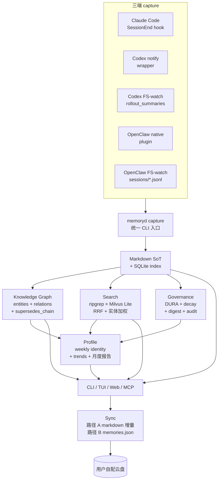
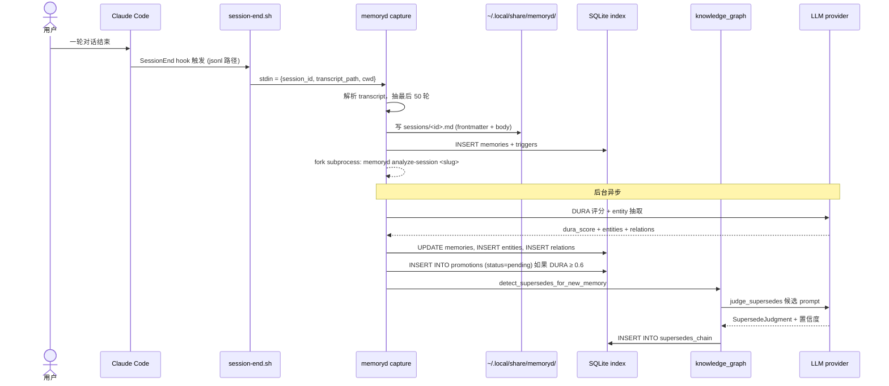
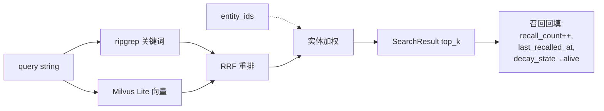
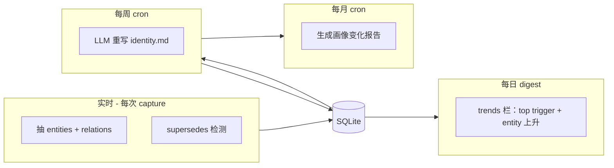
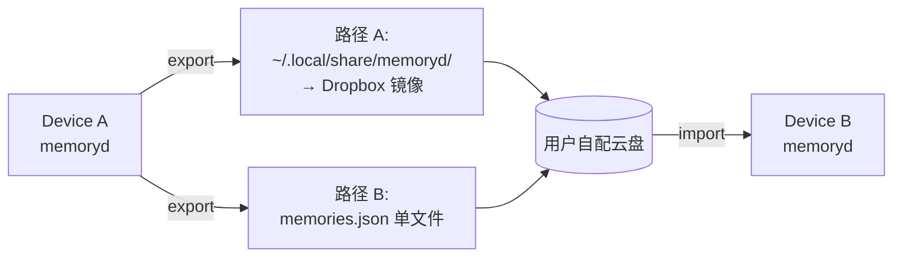

# 架构全景：从三端 capture 到画像自学习

## 一图全景



## 模块边界

### memoryd/src/memoryd/ —— 核心后端

| 子模块 | 职责 | 路径 |
|---|---|---|
| `cli.py` | 所有 CLI 子命令（一个 argparse 树） | [cli.py](https://github.com/zhuzhen-team/memory-system/blob/main/memoryd/src/memoryd/cli.py) |
| `schema.py` | frontmatter Pydantic schema | [schema.py](https://github.com/zhuzhen-team/memory-system/blob/main/memoryd/src/memoryd/schema.py) |
| `storage.py` | Markdown 读写 + atomic write | [storage.py](https://github.com/zhuzhen-team/memory-system/blob/main/memoryd/src/memoryd/storage.py) |
| `scope.py` + `scope_meta.py` | cwd → scope_hash + 元数据 | [scope.py](https://github.com/zhuzhen-team/memory-system/blob/main/memoryd/src/memoryd/scope.py) |
| `index.py` | SQLite 索引 + migrations | [index.py](https://github.com/zhuzhen-team/memory-system/blob/main/memoryd/src/memoryd/index.py) |
| `enc.py` + `passphrase.py` | AES-256-GCM + PBKDF2 跨机派生 | [enc.py](https://github.com/zhuzhen-team/memory-system/blob/main/memoryd/src/memoryd/enc.py) |
| `governance/` | DURA + decay + digest + audit + grants + merge | [governance/](https://github.com/zhuzhen-team/memory-system/tree/main/memoryd/src/memoryd/governance) |
| `embeddings/` | ONNX bge-m3（默认）+ OpenAI provider | [embeddings/](https://github.com/zhuzhen-team/memory-system/tree/main/memoryd/src/memoryd/embeddings) |
| `search/` | vector / hybrid / scoring / sessions | [search/](https://github.com/zhuzhen-team/memory-system/tree/main/memoryd/src/memoryd/search) |
| `llm/` | base + anthropic / openai / ollama + factory + prompts | [llm/](https://github.com/zhuzhen-team/memory-system/tree/main/memoryd/src/memoryd/llm) |
| `knowledge_graph/` | entity 抽取 + relation 写入 + supersedes 检测 + 图查询 | [knowledge_graph/](https://github.com/zhuzhen-team/memory-system/tree/main/memoryd/src/memoryd/knowledge_graph) |
| `profile/` | weekly identity 重写 + 月度报告 + trends | [profile/](https://github.com/zhuzhen-team/memory-system/tree/main/memoryd/src/memoryd/profile) |
| `sync/` | 路径 A markdown 增量 + 路径 B memories.json | [sync/](https://github.com/zhuzhen-team/memory-system/tree/main/memoryd/src/memoryd/sync) |
| `mcp_tools/` + `mcp_server.py` | 19 个 `mem_*` MCP 工具 | [mcp_server.py](https://github.com/zhuzhen-team/memory-system/blob/main/memoryd/src/memoryd/mcp_server.py) |
| `importers/` | CLAUDE.md / AGENTS.md / auto-memory / mcp-memory-service 一次性 import | [importers/](https://github.com/zhuzhen-team/memory-system/tree/main/memoryd/src/memoryd/importers) |
| `mirror.py` + `mirror_codex.py` + `mirror_openclaw.py` | FS-watch 三端 capture fallback | [mirror.py](https://github.com/zhuzhen-team/memory-system/blob/main/memoryd/src/memoryd/mirror.py) |
| `web/` | FastAPI Dashboard（11 个路由） | [web/](https://github.com/zhuzhen-team/memory-system/tree/main/memoryd/src/memoryd/web) |
| `tui/` | textual digest 审批 TUI | [tui/](https://github.com/zhuzhen-team/memory-system/tree/main/memoryd/src/memoryd/tui) |
| `platforms/` | launchd / systemd / Task Scheduler 跨平台 | [platforms/](https://github.com/zhuzhen-team/memory-system/tree/main/memoryd/src/memoryd/platforms) |
| `chunking.py` | 标题切块 + SHA-256 去重 | [chunking.py](https://github.com/zhuzhen-team/memory-system/blob/main/memoryd/src/memoryd/chunking.py) |
| `migrations/` | 5 个 SQL migration（initial / sensitive ×2 / KG / profile） | [migrations/](https://github.com/zhuzhen-team/memory-system/tree/main/memoryd/src/memoryd/migrations) |

### plugins/ —— 三端胶水

| 子目录 | 职责 |
|---|---|
| `claude-code/session-end.{sh,py,ps1}` | CC SessionEnd hook 跨平台脚本 |
| `codex/notify-wrapper.sh` + `notify-probe.sh` + `launchd/` | Codex notify wrapper + FS-watch launchd plist |
| `openclaw/src/{tools,hooks}/` + `openclaw.plugin.json` | OpenClaw native plugin：3 工具 + 2 hook + 兜底 lifecycle 桥接 |

## 写入路径



Codex / OpenClaw 走同一条 CLI 入口，仅 `--source` 不同：

- `--source=claude-code` —— CC SessionEnd hook
- `--source=codex` —— Codex notify wrapper（实时）
- `--source=codex-rollout` —— FS-watch rollout_summaries（事后兜底）
- `--source=openclaw` —— OpenClaw native plugin agent_end hook
- `--source=openclaw-fs` —— FS-watch openclaw sessions（兜底）
- `--source=manual` —— 手动 capture / `mem_save` 工具
- `--source=importer-*` —— 一次性 import

## 读取路径



详见 [搜索](search.md)。

## 学习路径



详见 [画像自学习](profile-learning.md)。

## 同步路径



详见 [跨设备同步](sync.md)。

## UI 层（4 种）

| 入口 | 用途 |
|---|---|
| **CLI** | `memoryd search / list / show / digest / sync ...` |
| **TUI** | `memoryd digest --tui` —— textual 终端交互 |
| **Web Dashboard** | `memoryd web` —— FastAPI 本地 loopback，含 11 个路由 |
| **MCP server** | `memoryd-mcp` —— 19 个 `mem_*` 工具，挂到 CC / Codex / OpenClaw |

## 配置链

```
环境变量
   ↓ 覆盖
~/.config/memoryd/config.toml
   ↓ 覆盖
默认值（memoryd/config.py 里 hardcoded）
```

字段总表见 [架构 · 治理](governance.md) 配置章节。

## 设计原则总结

- **Markdown 是 source of truth**，SQLite 可随时 `rebuild-index` 重建
- **本地优先**，外网调用仅限可选 LLM provider；ONNX bge-m3 embedding 完全本地
- **三端等价**，CC / Codex / OpenClaw 走同一后端，scope_hash 一致
- **可降级**，LLM 不可用时 KG 走 jieba 兜底，embedding 不可用时只做关键词，所有失败都不阻塞 capture
- **可审计**，所有写操作进 audit chain（SHA256 prev_hash 链）
- **不接管原生记忆**，叠加层而非替换层
