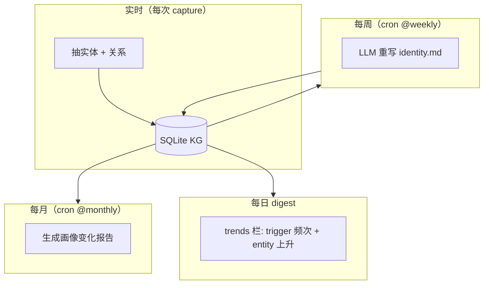

# 画像自学习：让 AI 越来越懂你

## 设计目标

用户**不需要写 prompt 解释自己是谁**。AI 拿起来就知道。

具体到机制：

- **画像不是一段静态描述**，而是**会随时间演化的活文档**
- 演化由 LLM 自动归纳，不依赖用户手填
- 演化过程**可审计、可回滚**：每周版快照保留，月度有变化报告，用户能看到
  "4 月你偏好 React，5 月切到 Solid 了"

## identity.md 是什么

位置：`~/.local/share/memoryd/profile/identity.md`

内容（最新一版，永远是 LLM 重写后的当下快照）：

```markdown
---
generated_at: 2026-05-18T03:00:00Z
generation_trigger: weekly_cron
sources_count: 137
sources_window: 2026-04-01..2026-05-18
prev_version_id: 47
diff_summary: 新增 Solid 偏好；移除 React 偏好（superseded）；新增项目 memory-system
---

# abble · 个人画像（2026-05-18 周报版）

## 身份与角色
- 软件工程师，深圳龙岗大运 5 栋 802，主力工作机 abble-mbp
- 主导项目：memory-system、wolin-clients-gathering、account-system

## 技术偏好（按强度）
- **前端**：Solid >> React（5 月切换，参见 supersede 链）
- **后端 Python**：FastAPI、uv 包管
- **数据**：SQLite + Markdown 双层；Milvus Lite 嵌入式向量

## 工作方式 / 协作偏好
- 偏好"autonomous + 中文汇总"
- 文档要中文；代码英文
- 拒绝 AskUserQuestion 面板

## 关注的概念
- 跨 harness 记忆（27 次提及）
- 自主学习（11 次）

## 近期决策（最高 confidence）
- 不要 v3 / 版本号 [2026-05-18]
- 只支持 CC / Codex / OpenClaw [2026-05-18]
```

## 三类自动学习任务



### 1. 实时：实体抽取 + 关系写入

详见 [知识图谱](knowledge-graph.md)。这是 identity 的原料。

### 2. 每周：LLM 重写 identity.md

源码：[memoryd/src/memoryd/profile/identity.py](https://github.com/zhuzhen-team/memory-system/blob/main/memoryd/src/memoryd/profile/identity.py)

prompt：[memoryd/src/memoryd/llm/prompts/rewrite_identity.py](https://github.com/zhuzhen-team/memory-system/blob/main/memoryd/src/memoryd/llm/prompts/rewrite_identity.py)

```python
def rewrite_identity_weekly():
    # 1. 拉本周 long-term + 高 recall_count 条目
    sources = query_memories(
        scope=None,                       # 全局，跨 scope
        types=["decision","preference","fact"],
        decay_state__ne="forgotten",
        recall_count__gte=2,
        limit=200,
    )
    # 2. top entity + supersede 演化
    top_entities = top_entities_by_mention_count(window_days=30, limit=30)
    recent_supersedes = recent_supersede_events(window_days=14)
    # 3. 上一版 identity 作 baseline
    prev = read_latest_profile_version()
    # 4. 喂 LLM
    new_identity_md = llm.rewrite_identity(
        sources=sources,
        top_entities=top_entities,
        recent_supersedes=recent_supersedes,
        prev_identity=prev.content_md,
        target_lang="zh-CN",
        max_chars=IDENTITY_MAX_CHARS,
    )
    # 5. 算 diff，落新版
    diff = compute_diff(prev.content_md, new_identity_md)
    save_profile_version(content_md=new_identity_md, trigger="weekly_cron",
                         diff_from_prev=diff)
    write_file("profile/identity.md", new_identity_md)
    audit_log("profile.rewrite", version_id=new_version_id, diff_summary=diff.summary)
```

`IDENTITY_MAX_CHARS` 在 prompt 里限定，避免 LLM 输出太长。

### 3. 每月：变化报告

源码：[memoryd/src/memoryd/profile/evolution.py](https://github.com/zhuzhen-team/memory-system/blob/main/memoryd/src/memoryd/profile/evolution.py)

prompt：[memoryd/src/memoryd/llm/prompts/profile_change_report.py](https://github.com/zhuzhen-team/memory-system/blob/main/memoryd/src/memoryd/llm/prompts/profile_change_report.py)

```python
def generate_monthly_change_report(period="2026-04"):
    versions = list_profile_versions_in_month(period)
    supersedes = supersede_events_in_month(period)
    entity_lifecycle = entity_changes_in_month(period)

    report = llm.write_change_report(
        versions=versions,
        supersedes=supersedes,
        entity_lifecycle=entity_lifecycle,
        target_lang="zh-CN",
    )
    write_file(f"profile/change-reports/{period}.md", report)
    store_in_profile_change_reports(period, report, ...)
```

生成内容示例：

```markdown
# 画像变化报告 · 2026-04

## 主要变化

- **前端偏好**：4 月主力 React，5 月切到 Solid。supersede 时间 2026-05-12，
  原因（从 capture 笔记推断）：性能 + 体积。
- **新增项目**：memory-system（5/9 起密集提及）。

## 新增实体（top 5）
- memory-system（45 次提及，已升为主项目）
- Solid（17 次）
- Milvus Lite（11 次）

## 退场实体（mention_count 跌为 0）
- 飞书 obsidian 集成（4 月调研，已结案）

## supersede 事件（共 6 次）
- preference#react → preference#solid [2026-05-12]
```

### 4. digest 的 trends 栏

源码：[memoryd/src/memoryd/profile/trends.py](https://github.com/zhuzhen-team/memory-system/blob/main/memoryd/src/memoryd/profile/trends.py)

`memoryd digest` 每天输出，trends 栏由 `render_trends_section()` 渲染：

```
=== Trends (last 7 days) ===

Top triggers:
  memory-system    27 hits
  knowledge-graph  12 hits
  identity         9 hits

Top entities (rising):
  Solid             +17 mentions
  memory-system     +45 mentions

Recent supersedes:
  preference#react → preference#solid

Recall hot:
  decision#feedback-autonomous-chinese  recalled 12 times this week
```

trigger 频次累加：

```python
def increment_trigger(conn, trigger: str, scope_hash: str = "_global"):
    conn.execute(
        """INSERT INTO trigger_stats (trigger, scope_hash, day, hits)
           VALUES (?, ?, ?, 1)
           ON CONFLICT (trigger, scope_hash, day)
             DO UPDATE SET hits = hits + 1""",
        (trigger, scope_hash, today_iso()),
    )
```

每次 search hit 或 capture 写 trigger 都会自动调用。

## CLI 入口

```bash
memoryd profile show                     # 看最新 identity.md
memoryd profile history                  # 列历次快照
memoryd profile diff --from=46 --to=47   # 对比两版
memoryd profile rewrite                  # 手工触发重写（默认每周自动）
memoryd profile report --month=2026-04   # 生成 / 重新生成月度报告
memoryd profile trends --window=7d
```

!!! note "CLI 路由"
    上述 `memoryd profile *` 命令由 `memoryd/profile/__init__.py` 暴露的函数
    驱动，目前主要走 cron + MCP 工具。CLI 命令面在持续完善；可直接调
    `python -c "from memoryd.profile import rewrite_identity_weekly; rewrite_identity_weekly()"`。

## Web Dashboard `/identity`

源码：[web/routes.py](https://github.com/zhuzhen-team/memory-system/blob/main/memoryd/src/memoryd/web/routes.py)（`/identity` / `/identity/version/{n}` / `/identity/diff` / `/api/identity/report/{period}`）

- `/identity` —— 当前 identity.md + 最近 5 个版本号 + 月度报告列表
- `/identity/version/{n}` —— 第 n 版历史快照
- `/identity/diff?from=46&to=47` —— 两版 diff
- `/api/identity/report/{period}` —— 月度报告原文 markdown

## 隐私边界

- `identity.md` 默认明文 —— 它是给"未来的你 + 任何 AI"看的
- 敏感 scope（`.memoryd-sensitive`）的内容**不参与** identity 生成，避免泄露
- LLM 调用走用户配置的 provider；走 Ollama 时全程本机

## 设计权衡

- **不让用户手填 identity.md**。任何手工编辑会在下一次 weekly rewrite 被覆盖。用户改 identity 的正确方式是**写记忆**（让事实发生在 long-term 里）
- **不让 AI agent 直接写 identity**。MCP 工具里没有 `identity_set`。identity 永远是被 LLM 周期性归纳出来的
- **版本号 monotonic 递增**。不允许跳号，方便 diff 与回查
- **prev_version_id 链**。任意一版可以一路 diff 回最早一版
