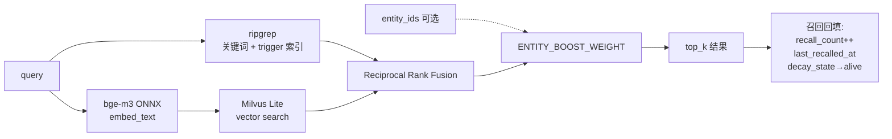

# 搜索：关键词 + 向量 + 实体加权混合

memoryd 的搜索是三条信号的融合：

1. **ripgrep 关键词** —— 命中精确字符串、人名、命令行片段
2. **Milvus Lite 向量** —— 命中语义近似（bge-m3 ONNX 本地默认）
3. **实体加权** —— 命中包含特定 entity 的记忆

三路结果走 **Reciprocal Rank Fusion (RRF)** 重排得到最终 top_k。



源码：[memoryd/src/memoryd/search/hybrid.py](https://github.com/zhuzhen-team/memory-system/blob/main/memoryd/src/memoryd/search/hybrid.py)

## 一、关键词层（ripgrep）

直接 spawn `rg` 进程扫 `scopes/<hash>/**/*.md`，附带 trigger 索引（SQLite `triggers` 表）做反向加速。

源码：[memoryd/src/memoryd/search/sessions.py](https://github.com/zhuzhen-team/memory-system/blob/main/memoryd/src/memoryd/search/sessions.py)

为什么用 ripgrep 不是纯 SQL：

- 已经为 SoT 是 markdown，扫文件最直接
- `.md.enc` 自动跳过（不解密）
- 速度足够；用户量级 N < 10000

## 二、向量层（Milvus Lite + bge-m3 ONNX）

每个 scope 一个 Milvus collection，文件级别 chunk 切分（标题层级切，SHA-256 去重）。

- **Milvus Lite**：嵌入式，不需要 docker。文件直接落 `~/.local/share/memoryd/milvus/`。
- **bge-m3 ONNX**：首次 embed 时从 HuggingFace 下载到 `~/.cache/memoryd/models/`，本地推理，无网络依赖。
- 默认 1024 维。
- 备选 provider：`openai` text-embedding-3-small（需要 API key）

源码：

- [memoryd/src/memoryd/embeddings/__init__.py](https://github.com/zhuzhen-team/memory-system/blob/main/memoryd/src/memoryd/embeddings/__init__.py) —— provider 抽象
- [memoryd/src/memoryd/embeddings/onnx_bge_m3.py](https://github.com/zhuzhen-team/memory-system/blob/main/memoryd/src/memoryd/embeddings/onnx_bge_m3.py) —— ONNX 默认
- [memoryd/src/memoryd/embeddings/openai_provider.py](https://github.com/zhuzhen-team/memory-system/blob/main/memoryd/src/memoryd/embeddings/openai_provider.py)
- [memoryd/src/memoryd/search/vector.py](https://github.com/zhuzhen-team/memory-system/blob/main/memoryd/src/memoryd/search/vector.py) —— Milvus 包装

切 chunk 规则：

- 按 markdown H2 / H3 切；最长 N 字符强切
- 每 chunk 一个 SHA-256 内容哈希，去重
- chunk_id 包含 embedding model name，换模型自动失效旧 chunk

源码：[memoryd/src/memoryd/chunking.py](https://github.com/zhuzhen-team/memory-system/blob/main/memoryd/src/memoryd/chunking.py)

## 三、实体加权

如果调用方传了 `entity_ids`（来自 KG 抽取或显式），命中实体的记忆得到一个 additive boost：

```python
final_score = RRF_score + (ENTITY_BOOST_WEIGHT if memory has entity_id else 0)
```

`ENTITY_BOOST_WEIGHT` 在 [search/scoring.py](https://github.com/zhuzhen-team/memory-system/blob/main/memoryd/src/memoryd/search/scoring.py) 配置。

典型用法：MCP `mem_search` 工具收到 `entity_ids=["entity:library:Solid"]` → 命中提到 Solid 的记忆排前面。

## 四、Reciprocal Rank Fusion (RRF)

源码：[memoryd/src/memoryd/search/scoring.py](https://github.com/zhuzhen-team/memory-system/blob/main/memoryd/src/memoryd/search/scoring.py)

```
RRF_score(d) = Σ_i 1 / (k + rank_i(d))
```

其中 i 遍历 ripgrep / vector 两路；`rank_i(d)` 是文档 d 在第 i 路里的排名；`k` 默认 60。

为什么用 RRF 不是加权求和：

- 不同信号的分数尺度不同（ripgrep frequency vs. 余弦相似度）
- RRF 只用排名，对尺度免疫
- 经验上对小数据集更稳

BM25 归一化 / lemmatize 等工具函数也在 `scoring.py`，供脚本调用。

## 五、降级路径

如果某条信号不可用：

| 缺失 | 行为 |
|---|---|
| Milvus Lite 没装 / 没初始化 | 自动跳过向量层，只走 ripgrep + 实体加权 |
| Embedding provider 配错 | 同上 |
| `entity_ids=None` | 跳过实体加权 |
| ripgrep 未安装 | 报错（这是硬依赖，安装时就该有） |

设计目标：**搜索永远能返回结果，即便所有可选信号都失效**。

## 六、CLI 入口

```bash
memoryd search "claude code hook"
memoryd search "x" --type=decision --scope=d8e86b48589e --limit=10 --json
```

源码：`cli.py` 的 `cmd_search`。该 CLI 是 `mem_search` MCP 工具的镜像（fewer arg surface）。

## 七、MCP 入口

```python
# mem_search 工具签名
async def mem_search(
    query: str,
    scope: str = "auto",
    top_k: int = 10,
    types: list[str] | None = None,
    entity_ids: list[str] | None = None,
) -> dict[str, Any]:
    ...
```

详见 [参考 · MCP 工具](../reference/mcp-tools.md)。

## 八、召回回填

任何 search hit 都会触发：

- `memories.recall_count += 1`
- `memories.last_recalled_at = now()`
- 如果 decay_state 是 `dim` / `soft-forgotten` → 拉回 `alive`
- `trigger_stats(trigger, scope_hash, day).hits += 1`（用于 trends digest）

源码：[memoryd/src/memoryd/profile/trends.py](https://github.com/zhuzhen-team/memory-system/blob/main/memoryd/src/memoryd/profile/trends.py)（`increment_trigger`）

## 性能预期

- ripgrep over 1k markdown：< 200ms
- Milvus Lite over 1k chunks（1024 维）：< 100ms
- 实体加权（SQLite join）：< 50ms
- 全链路 search：通常 < 500ms

用户量级 N > 10000 时可能需要重新评估。
