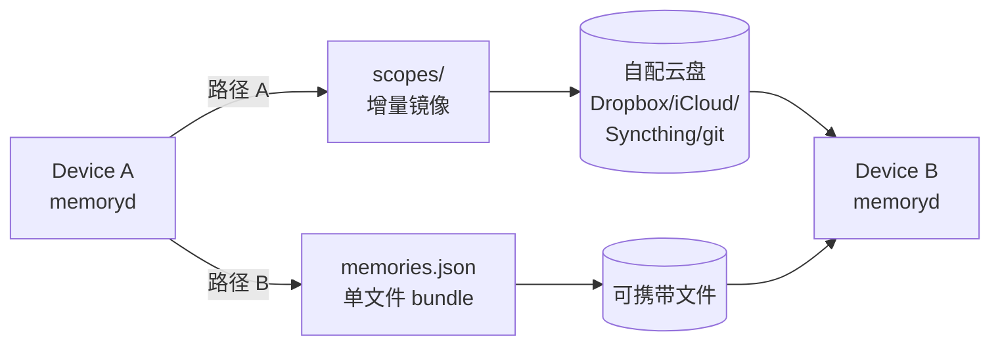

# 跨设备同步：两条独立路径，按场景选

memoryd 的同步设计原则：**一切以 Markdown 为根**。SQLite / Keychain / 审计目录 / grants 永不入同步盘。

支持两条独立路径：



## 路径 A：增量 markdown sync

适合"用户已经有自己的云盘"场景。memoryd 把 `~/.local/share/memoryd/scopes/` 镜像到用户配的 sync_dir。

源码：[memoryd/src/memoryd/sync/__init__.py](https://github.com/zhuzhen-team/memory-system/blob/main/memoryd/src/memoryd/sync/__init__.py)（`export` / `import_` / `status`）

**同步**：

- `*.md` —— 普通 markdown
- `*.md.enc` —— 加密文件（密文本身随同步盘走）
- `.scope-name` / `.memoryd-sensitive` —— scope 元数据

**不同步**（黑名单 + 白名单双重保护）：

| 路径 | 原因 |
|---|---|
| `index.db` / `index.db-wal` / `index.db-shm` | SQLite WAL 不可移植 |
| `audit/` | 审计链不能 merge |
| `grants/` | 授权状态只在本机 |
| `keyring/` | 密钥不出本机 |
| `logs/` / `probe/` | 本机调试用 |

CLI：

```bash
# 一次性配置
memoryd config set sync.enabled true
memoryd config set sync.dir ~/Dropbox/memoryd

# 日常
memoryd sync export                 # 增量推
memoryd sync export --scope=<hash>  # 仅指定 scope
memoryd sync export --dry-run

memoryd sync import                 # 反向：sync dir → local
memoryd sync status                 # per-scope counts + _conflicts
memoryd sync status --json
```

`sync.auto_export_on_session_end` / `sync.auto_import_on_session_start` 开了之后，每次 capture
自动 fork 同步任务（throttle 5 分钟）。

### 冲突解决

`memoryd sync import` 检测到本地和 sync dir 同 slug 但 fingerprint 不同时：

- 本地版备份到 `~/.local/share/memoryd/scopes/_conflicts/<slug>-<fp8>.md`
- sync 版上位
- 用户后续在 digest 复盘 / 手动 merge

源码：[memoryd/src/memoryd/sync/__init__.py](https://github.com/zhuzhen-team/memory-system/blob/main/memoryd/src/memoryd/sync/__init__.py)（`import_` 函数）

## 路径 B：memories.json 标准格式

适合"想要一份单文件可携带、可在不同记忆工具间迁移"场景。

源码：[memoryd/src/memoryd/sync/memories_json.py](https://github.com/zhuzhen-team/memory-system/blob/main/memoryd/src/memoryd/sync/memories_json.py)

schema 定义：[memoryd/src/memoryd/sync/schema.py](https://github.com/zhuzhen-team/memory-system/blob/main/memoryd/src/memoryd/sync/schema.py)

冲突合并：[memoryd/src/memoryd/sync/conflict.py](https://github.com/zhuzhen-team/memory-system/blob/main/memoryd/src/memoryd/sync/conflict.py)

### 关键属性

- **mcp-memory-service v5 向后兼容**：`memories[].{content, tags, created_at, memory_type}` 字段
  与 v5 完全一致，v5 工具可直接消费
- **memoryd 扩展字段**：`frontmatter / entities / relations / supersedes / identity_snapshot
  / audit_chain` 让另一台 memoryd 设备 import 后恢复全量状态
- **大文件 spill**：超 `chunk_size_mb`（默认 5 MiB）的 memory body 落到 `<out>.chunks/<sha>.bin`，
  主 JSON 只保留 manifest 指针，diff 不卡
- **passphrase 加密 opt-in**：敏感 scope 内容可配置成 `cipher_blob`，顶层 `encryption` 块
  记录 KDF 参数（PBKDF2-HMAC-SHA256, iter=600000）

完整 schema：[参考 · memories.json 格式](../reference/memories-json.md)

### CLI

```bash
memoryd sync export --out=~/memories-$(date +%F).json
memoryd sync export --out=~/x.json --scope=<hash> --include-audit-chain
memoryd sync import --from=memories.json --conflict=merge
memoryd sync diff-with-remote --from=memories.json
```

!!! note "memoryd v1.0 sync export/import 的 CLI 路径"
    路径 B 的 export / import 函数已实施（见 `sync/memories_json.py` 的
    `export_to_memories_json` / `import_from_memories_json` / `diff_with_remote`），
    通过 `memoryd sync export/import` 子命令呼出（详见 [CLI 命令](../reference/cli.md)）。

### 设备间冲突合并

audit chain 驱动的三方合并：

```
设备 A 最新 audit head: hashA
设备 B 最新 audit head: hashB
共同祖先: hashC

import 时：
1. 计算 A 和 B 各自相对 C 新增的 audit 条目
2. 按 ts 排序播放
3. 同 memory_id 冲突时按字段级 merge
4. supersedes 关系冲突 → 进 digest 待用户裁决
```

合并函数：`merge_memory_fields` in [conflict.py](https://github.com/zhuzhen-team/memory-system/blob/main/memoryd/src/memoryd/sync/conflict.py)。

## 路径 A vs B 推荐

| 场景 | 推荐 |
|---|---|
| 同人多设备日常同步 | **A**（增量、低延迟、走自有云盘） |
| 一次性迁移 / 备份 / 跨工具导入导出 | **B**（单文件可携带） |
| 跨账号 / 给同事一份 | **B**（可选 redact 敏感 scope） |
| 内网 / 没有云盘 | **B** + 任意文件传输（U 盘 / scp） |

两条路径可以**同时跑**：路径 A 做日常增量，路径 B 周期性备份单文件。

## 加密

### 本机加密

随机 256-bit 密钥存 OS keyring。文件以 `.md.enc` 形式落盘（AES-256-GCM）。
Markdown 头部明文标记 `encrypted: true`。

### 跨机 passphrase 模式

用户在每台机器输同一 passphrase → PBKDF2-HMAC-SHA256（iter=600000，salt 存 sync_dir）→ 派生密钥。
无需把 OS Keychain 跨机搬。

```bash
memoryd set-passphrase
memoryd config set sensitive.key_source passphrase
```

切换 passphrase（重新加密所有 `.md.enc`）暂走手工解密 + 重新 mark-sensitive；自动化在 v1.1 跟进。

### 敏感 scope 授权

即便记忆同步过来，访问敏感 scope 仍需用户当面授权：

```bash
memoryd grant ~/scopes/finance --duration once
memoryd grant ~/scopes/finance --duration session
memoryd grant ~/scopes/finance --duration task --task my-deep-work
memoryd revoke ~/scopes/finance --task my-deep-work
```

授权记录写 audit 链；**grants 目录不进同步盘**（避免一台机器授权另一台默认放行）。

## 审计链跨机

每条 audit 记录有 `prev_hash`（SHA256(prev_record_json)）→ 链式。

- 同机：永不断链（违反就报错）
- 跨机：通过 `sync export --include-audit-chain` 把链放进 memories.json，import 端验证签名 + 按 ts 顺序合并
- 篡改检测：`memoryd audit --verify` 重算所有 hash 与 stored hash 比对

## 跨平台 scope_hash caveat

scope_hash 派生自 resolved 路径。macOS `/Users/<u>/projects/foo` vs Linux `/home/<u>/projects/foo`
→ 不同 scope_hash → 同一逻辑项目在新机器算作新 scope。

解决方案（任选）：

1. **保持机器间 home dir 布局一致**（如 symlink `/Users/<u>` → `/home/<u>`）
2. **手动 move-scope**：在新机器上手工把旧 scope 内容挪到新 scope_hash 目录
3. **接受**：跨平台日常同步本来就该期望"两边各自管自己的 scope"

v2 计划从 git remote 派生 scope_hash，自动跨平台对齐。

## 失败模式

- **passphrase 忘记** → 所有 `.md.enc` 永久无法解（无 recovery）
- **同步盘损坏 / 部分文件** → import 时 `_conflicts/` 兜底，不会破坏本地
- **audit chain 断裂** → `memoryd audit --verify` 报错，先排查是否手动改了 audit.jsonl

## 设计权衡

- **SQLite 不进同步盘**。WAL 不可移植 + 体积大 + 可重建 = 不值得同步
- **audit log 不进同步盘**。审计链每机各自维护，跨机走 memories.json 标准合并
- **keyring 不进同步盘**。安全边界
- **passphrase 模式 opt-in**。默认 random（安全度最高），用户主动启用 passphrase 才能跨机解密
