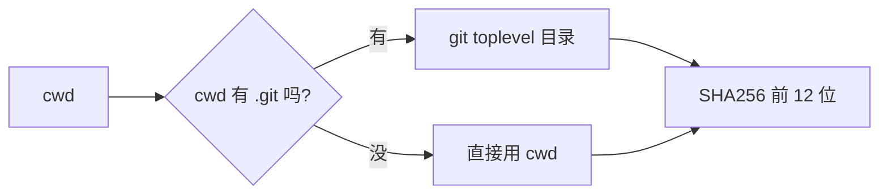
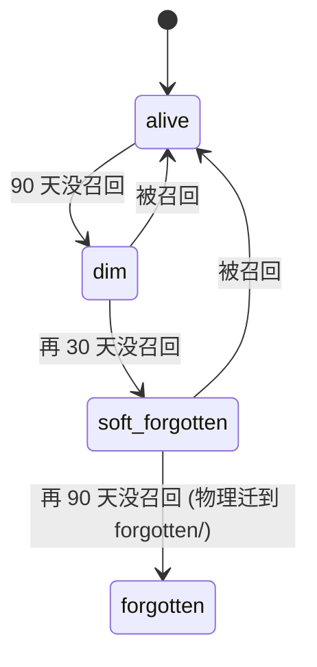

# 核心概念：scope / 记忆类型 / DURA / 衰减

理解这五个概念，整套系统的设计逻辑就通了。

## 1. scope（作用域）

memoryd 把记忆按 **scope** 分桶。一个 scope 大致对应一个项目 / 一个工作场景。

scope_hash 派生规则：



源码：[memoryd/src/memoryd/scope.py](https://github.com/zhuzhen-team/memory-system/blob/main/memoryd/src/memoryd/scope.py)

实际示例：

```bash
cd ~/memory-system
memoryd capture --source=manual <<< '{"session_id":"x","transcript_path":"","cwd":"'$(pwd)'"}'
# 落到 ~/.local/share/memoryd/scopes/<hash>/sessions/...
# <hash> 是 sha256("/Users/abble/memory-system") 的前 12 位
```

跨项目的全局记忆（identity.md / change-reports）不在任何 scope 下，存
`~/.local/share/memoryd/profile/`。

!!! warning "跨平台 scope_hash caveat"
    `/Users/<u>/foo` 和 `/home/<u>/foo` 算不同 scope_hash。
    同一逻辑项目在两台不同 OS 上会算两个 scope。详见 [同步配置](../operations/sync-setup.md)。

## 2. 记忆类型（六种）

frontmatter 字段 `type`：

| type | 何时用 | TTL 默认 | 自动 capture 会写吗 |
|---|---|---|---|
| `session` | 每次 capture 写的工作记忆 | 90 天 → decay | 是（所有三端 hook） |
| `decision` | 用户明确决策 | 永不过期 | 否，要 promote 或显式 record |
| `preference` | 工作偏好 | 永不过期 | 否 |
| `fact` | 客观事实 | 永不过期 | 否 |
| `playbook` | 操作流程 | 永不过期 | 否 |
| `warning` | 踩过的坑 | 永不过期 | 否 |

源码：[memoryd/src/memoryd/schema.py](https://github.com/zhuzhen-team/memory-system/blob/main/memoryd/src/memoryd/schema.py)

`session` 是**工作记忆**；`decision/preference/fact/playbook/warning` 是**长期记忆**。
工作记忆要经过 DURA 评分 + 用户审批才能升级为长期记忆。

## 3. DURA：4 准则评分

```
D — Decision-worthy   有决策价值（不是闲聊摘要）
U — Useful in future  对未来有用
R — Recallable hooks  有具体可召回的钩子（人名 / 项目名 / 时间）
A — Accurate          准确（不是 LLM 编出来的）
```

每条 session 写完后，后台 LLM 异步评分，得出 `dura_score = {D: 0.x, U: 0.x, R: 0.x, A: 0.x}`。
均分 ≥ 0.6 自动进 `promotions` 表，状态 `pending`，等用户审批：

```bash
memoryd digest                   # 看待审清单
memoryd promote <promotion_id>   # 批准
```

源码：[memoryd/src/memoryd/governance/analyze.py](https://github.com/zhuzhen-team/memory-system/blob/main/memoryd/src/memoryd/governance/analyze.py)

详见 [架构 · 治理](../architecture/governance.md)。

## 4. decay（衰减状态机）

session 类型有 TTL；长期类型默认永不过期。`decay_state` 三档：



| 状态 | 默认搜索可见 | 物理位置 |
|---|---|---|
| `alive` | 是 | `sessions/` |
| `dim` | 是 | `sessions/` |
| `soft-forgotten` | **否**（除非加 `--include-forgotten`） | `sessions/` |
| `forgotten` | 否 | `forgotten/`（归档目录） |

被召回会把状态拉回 `alive` 并刷新 `last_recalled_at`。

源码：[memoryd/src/memoryd/governance/decay.py](https://github.com/zhuzhen-team/memory-system/blob/main/memoryd/src/memoryd/governance/decay.py)

手动跑：

```bash
memoryd decay-sweep
```

正常每天 03:00 由 cron 自动跑。

## 5. supersedes（决策演化追踪）

用户用 React 半年 → 切 Solid。系统应该：

1. 不删旧偏好（历史可追溯）
2. 标 `superseded_by` 在旧条目上
3. 新条目里 `supersedes: [<old_id>]`
4. 召回时只有新条目浮起来，旧条目降权

每次 capture 完抽实体后，查同 entity 的所有旧 preference/decision/fact，用 LLM 判定：

- confidence ≥ 0.85 → 自动 supersede
- 0.5 ≤ confidence < 0.85 → 进 digest 待人工
- < 0.5 → 忽略

源码：[memoryd/src/memoryd/knowledge_graph/supersedes.py](https://github.com/zhuzhen-team/memory-system/blob/main/memoryd/src/memoryd/knowledge_graph/supersedes.py)

详见 [知识图谱](../architecture/knowledge-graph.md)。

## 6. identity（用户画像）

`~/.local/share/memoryd/profile/identity.md` 是**未来的你回来看现在的你**的一面镜子。

- 每周 weekly_cron 触发 LLM 重写一次，喂的是本周所有 long-term + 高 recall_count 记忆
- 每月生成一份变化报告 `profile/change-reports/YYYY-MM.md`
- 历次快照存 SQLite `profile_versions` 表，可 diff、可回查

源码：[memoryd/src/memoryd/profile/identity.py](https://github.com/zhuzhen-team/memory-system/blob/main/memoryd/src/memoryd/profile/identity.py)

详见 [画像自学习](../architecture/profile-learning.md)。

## 7. 敏感作用域

某些项目（涉及客户信息 / 凭证 / 财务）希望额外保护：

```bash
memoryd mark-sensitive ~/scopes/finance
```

操作后：

- `.memoryd-sensitive` marker 文件落到 scope 根
- AES-256-GCM 密钥进 OS keyring（macOS Keychain / Linux Secret Service / Windows DPAPI）
- 现存所有 `.md` 加密成 `.md.enc`，原 `.md` 删除
- SQLite `memories.scope_sensitive = 1`
- 子目录自动继承

访问需要授权：

```bash
memoryd grant ~/scopes/finance --duration session    # 8 小时
memoryd grant ~/scopes/finance --duration once       # 90 秒
memoryd grant ~/scopes/finance --duration task --task my-deep-work
```

所有访问都进 append-only 审计链：

```bash
memoryd audit --scope=<hash>
```

详见 [加密](../operations/encryption.md)。

---

理解了这七个概念，整套系统的设计就通了。接下来：

- 看整体怎么搭：[架构全景](../architecture/overview.md)
- 看 CLI 全清单：[CLI 命令](../reference/cli.md)
