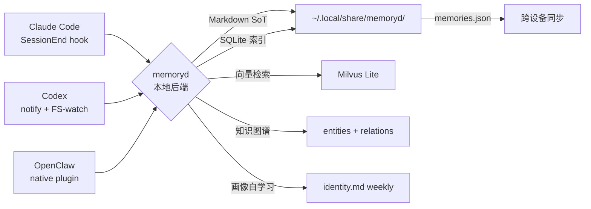

# memory-system：让记忆跟着人走，不跟着工具走

**memory-system** 是一套本地优先的个人记忆系统。它给 **Claude Code、Codex、OpenClaw** 三端 AI
提供同一份本地、可加密、可同步、会自动学习用户画像的记忆底座。

!!! quote "设计目标"
    无论今天用哪一个 AI，明天换一个 AI，后天又换设备 —— **记忆都跟着人走，不跟着工具走**。

## 它能做什么

- **三端打通**：Claude Code 用原生 hook，Codex 用 notify wrapper + 文件系统监听，OpenClaw 用原生 TS plugin。
  三端写入同一记忆库，互相读得到对方写的内容。
- **本地优先**：所有记忆默认存在本机 `~/.local/share/memoryd/` 下的 Markdown 文件 + SQLite 索引。
- **会自动学习**：每次会话结束自动抽实体、写关系、检测决策演化；每周 LLM 重写 `identity.md`；每月生成画像变化报告。
- **混合搜索**：ripgrep 关键词 + Milvus Lite 向量（bge-m3 ONNX 本地默认） + RRF 重排 + 实体加权。
- **跨设备同步**：标准 `memories.json` 格式（兼容 mcp-memory-service v5），可经任意云盘同步。
- **可审批**：会话摘要先入"工作记忆"，DURA 4 准则评分 + 用户审批通过后才升为"长期记忆"。
- **敏感保护**：标记敏感的 scope 自动 AES-256-GCM 加密 + 授权访问 + 审计链。

## 快速入口

| 你想做的事 | 看哪里 |
|---|---|
| 第一次安装它 | [安装](getting-started/installation.md) → [首次运行](getting-started/first-run.md) |
| 理解核心概念（scope、DURA、衰减） | [核心概念](getting-started/concepts.md) |
| 看整体怎么搭的 | [架构全景](architecture/overview.md) |
| 配 CC / Codex / OpenClaw 三端 | [三端集成](integrations/claude-code.md) |
| 查 CLI 命令 / MCP 工具列表 | [CLI 命令](reference/cli.md) · [MCP 工具](reference/mcp-tools.md) |
| 日常运维 / 跨机同步 / 故障排查 | [日常使用](operations/daily.md) · [同步配置](operations/sync-setup.md) · [故障排查](operations/troubleshooting.md) |
| 看仓库源码结构 / 跑测试 | [仓库结构](development/repo-layout.md) · [测试](development/testing.md) |

## 当前状态

memoryd v1.0.0 — 全部核心模块已落地：

- 三端 capture（CC SessionEnd hook + Codex 双通路 + OpenClaw native plugin） — 已实施
- Markdown SoT + SQLite index + 加密 `.md.enc` — 已实施
- DURA 治理 + decay + digest + TUI 审批 — 已实施
- 知识图谱（entities / relations / supersedes_chain） — 已实施
- 画像自学习（weekly identity / 月度变化报告 / trends） — 已实施
- 混合搜索（ripgrep × Milvus Lite RRF + 实体加权） — 已实施
- 跨设备同步（路径 A 增量 markdown + 路径 B memories.json） — 已实施
- 19 个 `mem_*` MCP 工具（13 agent + 6 admin） — 已实施
- Web Dashboard 11 个路由 + 4 个新页面（首页 / relations / trends / identity） — 已实施
- 跨平台（macOS / Linux / Windows） — 已实施

## 数据所有权

`~/.local/share/memoryd/` 下的所有 Markdown 是 **source of truth**。SQLite 只是索引，可随时
`memoryd rebuild-index` 从 Markdown 重建。这意味着即便 memoryd 被卸载，记忆依旧是普通的、
可读的、人类可编辑的 Markdown 文件。
