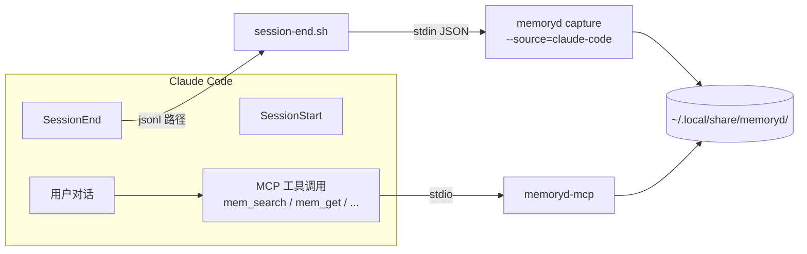

# Claude Code 集成：从 hook 到 MCP

Claude Code（CC）是 memoryd 的"一等公民"——它本身就有完整的 hook + MCP 体系，
所以接入路径最直接。

## 工作方式



## 写入：SessionEnd hook

CC 会话结束时由 CC 原生 hook 系统触发：

```jsonc
// ~/.claude/settings.json
{
  "hooks": {
    "SessionEnd": [
      {
        "matcher": "*",
        "hooks": [
          {
            "type": "command",
            "command": "/Users/abble/memory-system/plugins/claude-code/session-end.sh"
          }
        ]
      }
    ]
  }
}
```

`session-end.sh` 干的事：

1. 收到 CC 传入的 transcript JSONL 路径
2. 拼出 stdin JSON payload `{session_id, transcript_path, cwd}`
3. 调 `memoryd capture --source=claude-code`
4. memoryd 解析 transcript → 写 `sessions/<id>.md`
5. fork 后台 subprocess `memoryd analyze-session <slug>`（DURA + KG 抽取）

跨平台脚本：

- macOS / Linux：[plugins/claude-code/session-end.sh](https://github.com/zhuzhen-team/memory-system/blob/main/plugins/claude-code/session-end.sh)
- Windows：[plugins/claude-code/session-end.ps1](https://github.com/zhuzhen-team/memory-system/blob/main/plugins/claude-code/session-end.ps1)
- 通用 Python fallback：[plugins/claude-code/session-end.py](https://github.com/zhuzhen-team/memory-system/blob/main/plugins/claude-code/session-end.py)

## 读取：MCP 工具

把 `memoryd-mcp` 接到 CC 的 user-level MCP servers，方法见 [安装](../getting-started/installation.md) 第五步。
重启 CC 后 `/mcp` 命令里能看到 **memoryd**，下属 13 个 agent 工具（admin 工具默认隐藏）：

- `mem_save` / `mem_update` / `mem_delete` / `mem_get`
- `mem_search` / `mem_context` / `mem_timeline`
- `mem_session_start` / `mem_session_end` / `mem_session_summary` / `mem_capture_passive`
- `mem_judge` / `mem_compare`

详见 [参考 · MCP 工具](../reference/mcp-tools.md)。

## 配套 sub-agent：memory-searcher

`memoryd setup install-memory-searcher` 把 `memory-searcher.md` 模板拷贝到 `~/.claude/agents/`。

```bash
memoryd setup install-memory-searcher          # 全局
memoryd setup install-memory-searcher --force  # 覆盖
memoryd setup install-memory-searcher --target=./.claude/agents/  # 项目级
```

模板：用 haiku-4-5 + Read + Grep 工具搜 `~/.local/share/memoryd/scopes/`，输出 ≤ 500 token 的 JSON 命中结果。
主 context 零占用，避免污染主对话。

装好后用户在 CC 里说"找一下上次关于 X 的"等 prompt，CC 主智能体可自动调用 memory-searcher 检索；
sensitive scope 自动跳过（`.md.enc` 不读）。

## CC 端用户体验

打开新会话 → 用户对话 → 一些场景下需要查历史：

```
你：我之前那个 React → Solid 的切换是怎么决定的？
AI：[调 mem_search "React Solid 切换"]
    根据你的记忆系统，2026-05-12 你记了一条 decision：
    原因 性能 + 体积；当时是 superseded preference#react。
    要看完整 transcript 吗？
```

会话结束 → SessionEnd hook 自动 capture → 下次重启 CC 就能用。

## 与 CC 内置 `/memory` / `CLAUDE.md` 的关系

| CC 内置 | memoryd |
|---|---|
| `/memory` 编辑 `~/.claude/memory/*.md` | 不受影响 |
| 项目根 `CLAUDE.md` | memoryd 可一次性 import：`memoryd import claude-md` |
| `~/.claude/projects/*/memory/` auto-memory | memoryd 可 import：`memoryd import auto-memory` |

memoryd 是**叠加**层，不接管 CC 原生记忆，**双轨**存在。你可以用 `/memory` 写明确条目，memoryd 兜底捕获其余对话。

## 一次性 import 旧记忆

```bash
# 从 CC 的 CLAUDE.md 按段切（H2/H3 → fact/playbook/warning/decision/preference）
memoryd import claude-md ~/.claude/CLAUDE.md

# 从 auto-memory 目录整段导
memoryd import auto-memory ~/.claude/projects/-Users-you/memory/

# 显式指定 scope / dry-run
memoryd import claude-md ~/path.md --scope=<hash> --dry-run
```

所有 import 都是**单向**——memoryd 不双向同步 CLAUDE.md / auto-memory。

## 故障排查

```bash
# 看 hook 是否注册成功
cat ~/.claude/settings.json | jq '.hooks.SessionEnd'

# 看 hook 日志
tail -f ~/.local/share/memoryd/logs/cc-session-end.log

# 手工跑 session-end
plugins/claude-code/session-end.sh /path/to/last-transcript.jsonl

# 最近 capture
memoryd list --recent=5
```

如果 MCP 工具没出现：

```bash
# 检查 ~/.claude.json（不是 ~/.claude/.mcp.json）
cat ~/.claude.json | jq '.mcpServers.memoryd'

# 手工跑 mcp server
memoryd-mcp --verbose
# 应该打出 "memoryd-mcp ready: transport=stdio tools=13 admin=False"
```
