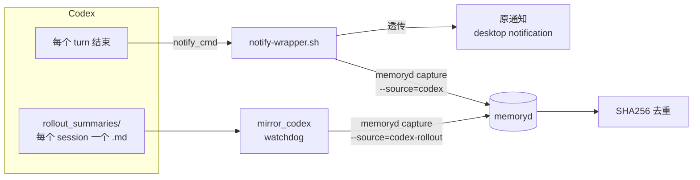

# Codex 集成：双通路（notify wrapper + FS-watch）

Codex CLI 不像 Claude Code 有 SessionEnd hook，但有两个抓手：

1. **`notify_cmd`** —— Codex 在 turn 结束等时机会调用用户配置的 `notify_cmd`，传入事件 JSON
2. **rollout 文件** —— Codex 把每个会话的 rollout summary 写到 `~/.codex/memories/rollout_summaries/*.md`

memoryd 同时用两条路径，靠 SHA256 内容哈希去重。



## 路径 1：notify wrapper（主，实时）

源码：[plugins/codex/notify-wrapper.sh](https://github.com/zhuzhen-team/memory-system/blob/main/plugins/codex/notify-wrapper.sh)

```toml
# ~/.codex/config.toml
notify = ["/Users/abble/memory-system/plugins/codex/notify-wrapper.sh", "turn-ended"]
```

`notify-wrapper.sh` 干的事：

1. 收到 Codex 传的事件 JSON（stdin）
2. **透传原 notify**：如果用户原来有 notify_cmd（比如 macOS desktop notification），先调它
3. 调 `memoryd capture --source=codex --event=<json>` 异步写入

用户感受不到 wrapper 的存在，原有桌面通知照常工作。

### 一键切换

```bash
# 先用 probe 摸清当前 Codex 版本传什么字段
memoryd setup swap-codex-notify --to probe
# 跑一轮 Codex turn，tail ~/.local/share/memoryd/probe/notify-probe.log 看 JSON 结构

# 确认无误后切到 wrapper
memoryd setup swap-codex-notify --to wrapper

# 回滚
memoryd setup swap-codex-notify --to original
```

子命令自动：

- 把 `~/.codex/config.toml` 备份到 `~/.claude/backups/`
- 用 Python tomllib 读，正则替换 `notify` 字段保留其他 keys
- 把原 notify target 存到 `~/.codex/.memoryd-notify-state.json`，便于 `--to original` 回滚

源码：[memoryd/src/memoryd/setup.py](https://github.com/zhuzhen-team/memory-system/blob/main/memoryd/src/memoryd/setup.py)（`swap_codex_notify`）

### 删除死的 Stop hook 条目

Codex 旧版本 `hooks.json` 里可能残留 `Stop` 事件配置，但当前 Codex 对这个事件零触发。清理：

```bash
memoryd setup remove-codex-stop-hook
```

## 路径 2：FS-watch 守护（兜底，事后）

源码：[memoryd/src/memoryd/mirror_codex.py](https://github.com/zhuzhen-team/memory-system/blob/main/memoryd/src/memoryd/mirror_codex.py)

`mirror_codex.py` 用 `watchdog` 监听 `~/.codex/memories/rollout_summaries/`：

- 新增 `.md` 文件 → 解析 → 写 memoryd scope 下 `sessions/`，source=codex-rollout
- 修改 → 更新对应 memory（去重靠 content_hash）

为什么要双路径？因为 notify_cmd 在 Codex 某些子命令下不触发（比如 `--exec` 模式），而 rollout 一定写。
两者交叉去重靠 SHA256(content)。

### launchd 安装（macOS）

```bash
memoryd setup install-launchd-mirror
launchctl bootstrap gui/$(id -u) ~/Library/LaunchAgents/com.memoryd.mirror.plist
launchctl print gui/$(id -u)/com.memoryd.mirror
```

launchd plist 模板：[plugins/codex/launchd/com.memoryd.mirror.plist](https://github.com/zhuzhen-team/memory-system/blob/main/plugins/codex/launchd)

Linux / Windows 等价物由 [memoryd/src/memoryd/platforms/](https://github.com/zhuzhen-team/memory-system/tree/main/memoryd/src/memoryd/platforms) 生成
（systemd user unit / Task Scheduler）。

## 验证

```bash
# 实时通路日志
tail -f ~/.local/share/memoryd/logs/codex-notify.log

# FS-watch 通路日志
tail -f ~/.local/share/memoryd/logs/mirror.stderr.log

# 新生成的 memoryd 条目
memoryd list --source=codex --recent=5
memoryd list --source=codex-rollout --recent=5

# launchd 守护是否在跑
launchctl list | grep memoryd
```

## 给 Codex 注入 memoryd 上下文

Codex 不像 CC 有 SessionStart hook，但有：

- **`AGENTS.md` 系统提示**：项目根 / 用户目录的 AGENTS.md 会被 Codex 当作系统提示
- memoryd 可在 cron 每天把 identity.md 节选 + 最近实体 → 写到 `~/.codex/AGENTS.md.memoryd-include`，
  用户在自己的 AGENTS.md 里 `@include` 引用

这部分目前是手工编排，未来计划做成 `memoryd setup install-codex-agents-include` 子命令。

## 一次性 import AGENTS.md

```bash
memoryd import agents-md ~/.codex/AGENTS.md
```

按 H2/H3 切（同 claude-md heuristic），落 fact/playbook/warning/decision/preference。

## 故障排查

```bash
# notify 配置
cat ~/.codex/config.toml | grep notify

# 实时通路诊断
plugins/codex/notify-probe.sh
# 让 Codex 实际调一次，看 ~/.local/share/memoryd/probe/notify-probe.log

# launchd 状态
launchctl list | grep memoryd

# 手动跑一次 mirror（单次扫描，不 watch）
memoryd mirror --codex --once

# 最近 capture
memoryd list --source=codex-rollout --recent=5
```

## 故障：notify_cmd 没触发

- 检查 `~/.codex/config.toml` 的 notify 字段确实指到 `notify-wrapper.sh`
- 检查脚本 `chmod +x`
- Codex 在 `--exec` 模式下不发 notify；只能靠 FS-watch 兜底
- 跑一轮 `codex` 看 `~/.local/share/memoryd/logs/codex-notify.log` 是否有新行
