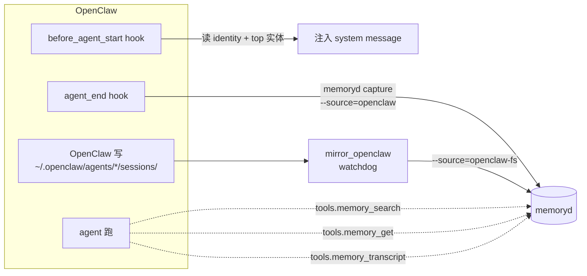

# OpenClaw 集成：native plugin + FS-watch 兜底

OpenClaw 是一等公民——和 CC 不同，OpenClaw 有完整的 plugin SDK，能：

1. 注册 hook（`before_agent_start` / `before_prompt_build` / `agent_end` / 任意命名事件）
2. 暴露工具给 agent 调用（不需要 MCP server，直接 native）
3. 修改 prompt（注入 / 截断 / 转译）

memoryd 走 **native plugin + FS-watch 兜底**。



源码：

- [plugins/openclaw/src/](https://github.com/zhuzhen-team/memory-system/tree/main/plugins/openclaw/src) —— native plugin
- [plugins/openclaw/README.md](https://github.com/zhuzhen-team/memory-system/blob/main/plugins/openclaw/README.md) —— 详细使用
- [memoryd/src/memoryd/mirror_openclaw.py](https://github.com/zhuzhen-team/memory-system/blob/main/memoryd/src/memoryd/mirror_openclaw.py) —— FS-watch fallback

## Native plugin：3 工具 + 2 hook

文件结构：

```
plugins/openclaw/
├── openclaw.plugin.json     # plugin manifest
├── package.json
├── src/
│   ├── index.js              # plugin 入口（definePluginEntry）
│   ├── register.js           # 旧 SDK lifecycle 事件桥接
│   ├── memoryd_client.js     # 调本地 memoryd CLI (spawn) / HTTP
│   ├── payload.js            # 共享 payload 构造
│   ├── hooks/
│   │   ├── before_agent_start.js
│   │   └── agent_end.js
│   └── tools/
│       ├── index.js
│       ├── memory_search.js
│       ├── memory_get.js
│       └── memory_transcript.js
└── tests/
```

零新依赖：纯 Node ≥ 18 stdlib + `node:test`，没有 `npm install` 步骤。

### 三个工具（agent 可直接调用）

| 工具 | 作用 |
|---|---|
| `memory_search(query, top_k?, scope?)` | 调 memoryd hybrid search 返回 top_k 条摘要 |
| `memory_get(memory_id)` | 取一条完整 markdown + frontmatter |
| `memory_transcript(memory_id)` | 取该 session 的完整 transcript（如可用） |

### 两个 hook

| hook | 做什么 |
|---|---|
| `before_agent_start` | 调 memoryd 拉最近 identity 节选 + top 实体 + 最近 5 条 long-term → 注入 system message |
| `agent_end` | 异步把这一轮对话喂 LLM 生成三人称要点 → `memoryd capture --source=openclaw` |

### 兜底：lifecycle 事件桥接

旧 SDK 没有 agent_end 时用 `register.js` 那条订阅 (`registerAgentEventSubscription`) 兜底。

## 安装

```bash
cd /Users/abble/memory-system/plugins/openclaw
openclaw plugins install --force .
openclaw plugins list | grep memoryd-openclaw
```

授权（hook 需要看 conversation，工具不需要）：

```bash
openclaw config set plugins.entries.memoryd-openclaw.hooks.allowConversationAccess true
openclaw config set plugins.entries.memoryd-openclaw.hooks.allowPromptInjection true
```

否则 `agent_end` 拿不到 transcript，只能用粗摘要。

可选配置（`~/.openclaw/config.toml`）：

```toml
[plugins.entries.memoryd-openclaw.config]
transport    = "cli"                          # 或 "http"
binPath      = "/usr/local/bin/memoryd"       # 覆盖 MEMORYD_BIN
port         = 8765
autoCapture  = true                           # 关掉就停止 agent_end 自动写
autoRecall   = true                           # 关掉就停止 before_agent_start 注入
```

## FS-watch 兜底

如果 OpenClaw plugin 因为版本 / 加载顺序 / 用户禁用导致没生效，`mirror_openclaw.py`
监听 `~/.openclaw/agents/*/sessions/*.jsonl`，fallback capture，source=openclaw-fs。

`memoryd setup install-launchd-mirror` 一并装好（plist 同时覆盖 codex + openclaw 路径）。

## 工具调用示例（agent 内）

```javascript
// 1) 找最近的相关记忆
const hits = JSON.parse(
  (await tools.memory_search({ query: "abble 切 Solid 决策", top_k: 5 }))
    .content[0].text
);
// hits: [{ memory_id, content_preview, scope, created_at, dura_score, source }]

// 2) 取详情
const md = (await tools.memory_get({ memory_id: hits[0].memory_id })).content[0].text;

// 3) 取 transcript
const tr = (await tools.memory_transcript({ memory_id: hits[0].memory_id }))
  .content[0].text;
```

## 跨 harness 一致性

OpenClaw native plugin 跟 CC / Codex 走同一 memoryd 后端：

- 同 scope_hash 算法 → 在同一项目下三端读写同一 scope
- 同 audit chain → 任何 harness 写的都进同一审计链
- entity / relation 表全局共享 → 一个 harness 抽出的实体另一个也能查到

→ 在 OpenClaw 里说"我新接了个客户叫张三" → 切到 CC 问"我最近接了哪些客户" → CC 能查到张三（同 entity）。

## 设计要点

- **零新依赖**：纯 Node ≥ 18 stdlib
- **fire-and-forget**：所有 capture / recall 失败都只写日志，不阻塞 agent；即便 memoryd 进程暂时挂了，OpenClaw 也能照常用
- **不接管原生记忆**：plugin manifest 故意不设 `kind: "memory"`，OpenClaw 自带的 memory-core 仍然工作

## 故障排查

```bash
# 看 plugin 是否被 OpenClaw 加载
openclaw plugins list | grep memoryd-openclaw

# 看 SDK 通路日志
tail -f ~/.local/share/memoryd/logs/openclaw-events.log

# 看 FS-watch 通路日志
tail -f ~/.local/share/memoryd/logs/mirror.stderr.log

# 手动单次 mirror
memoryd mirror --openclaw --once

# 最近 capture
memoryd list --source=openclaw --recent=5       # SDK 实时
memoryd list --source=openclaw-fs --recent=5    # FS-watch 兜底
```
