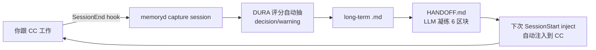

# HANDOFF.md — AI 协作时代的"交接班记录"

> memoryd 的 `identity.md` 是给"**这个人**"的长期记忆。**HANDOFF.md** 是给"**这个项目**"的当下状态快照——
> 写在项目根、跟代码一起 git，下一个会话 / 接手者 10 分钟就能进入状态。

## 它解决什么

Claude Code 每次会话上下文都从零开始。如果不主动管理：

- 给 AI 解释了三遍"我在做 X，已经完成 Y，下一步 Z"——换个会话又得讲一遍
- `/clear` 之前没记录，新会话走错方向，推翻重做
- 同事 / 新设备打开项目——只看代码不懂"现在到哪了"

memoryd 已经会自动记你的 long-term decisions / warnings / sessions，但那是 user-level
私有记忆——同事 clone 你的 repo 看不到。HANDOFF.md 把"当前项目状态 + 下一步"显式化到一份
**项目根目录、可 commit 的 markdown**，配合 SessionStart inject 让交接零摩擦。

## 一份好 HANDOFF 长什么样

6 个区块，按顺序写。`memoryd handoff write` 生成的 LLM 输出严格遵循这个结构：

```markdown
# HANDOFF — <项目名> (<日期>)

## 1. TL;DR
（一段话。让人扫一眼就懂"我们在做 X，已经完成 Y，当前卡在 Z，下一步是 W"。）

## 2. 当前状态
- ✅ 已完成：<具体到文件 / 函数 / commit>
- 🟡 进行中：<具体到哪个函数，无则写"无"，不要空>
- ⏳ 未开始：<剩下范围>

## 3. 下一步立即要做的事
**优先级 1**：<能直接动手的指令>
**优先级 2**：…

## 4. 关键决策记录
- <决策>：→ <**为什么**这么定>
- 已经否决的方案：<避免新人再踩>

## 5. 文件结构 / 入口
- `path/to/file.py` — 它干什么
- 关键函数：`file.py:123` 的 `func_name()`

## 6. 已知坑 / 待办
- ⚠️ <已知陷阱>
- TODO: <临时记号>
- BUG: <已知问题>
```

## 命令速查

```bash
# 在项目根目录跑：生成 HANDOFF.md（LLM 自动凝练 6 区块）
memoryd handoff write

# 已有 HANDOFF 时保留旧的，写一份带日期的快照
memoryd handoff write --snapshot
# → 产出 HANDOFF-2026-05-24.md，HANDOFF.md 不动

# 强制覆盖现有 HANDOFF.md
memoryd handoff write --force

# 写到任意路径（escape hatch；不会触发 SessionStart 自动注入，仅用作快速预览 / 别处存档）
memoryd handoff write --out=/tmp/handoff-preview.md

# 不调 LLM，纯素材结构化输出（无 LLM 费用、离线可用）
memoryd handoff write --no-llm

# 预览不写文件
memoryd handoff write --dry-run

# 读出当前 HANDOFF
memoryd handoff read
memoryd handoff read --date=2026-05-20    # 读历史快照

# 列项目根的所有 HANDOFF
memoryd handoff list
```

!!! tip "`--out` vs `--snapshot` vs 默认"
    - **默认**：写 `<cwd>/HANDOFF.md`。这是唯一会被 SessionStart inject 自动注入的位置
    - **`--snapshot`**：写 `<cwd>/HANDOFF-YYYY-MM-DD.md`，留作历史归档。不替换 canonical 版本
    - **`--out=<path>`**：写到任意路径。**不会**被 inject 拾取——纯属"我想到桌面看一下"或"放到 Drive 里给别人"用

## SessionStart 自动读 HANDOFF

`memoryd inject`（CC SessionStart hook）会自动检测 cwd 下的 HANDOFF.md，把它作为 quoted
block 放在 `additionalContext` 最上面（在 identity 之前 —— 项目当下状态 > 长期画像）。

也就是说：**只要 HANDOFF.md 存在，下次开会话 Claude 就知道当前进展，无需你手动 paste**。
你不会在 CC UI 里直接看到这段（它走 `additionalContext`），但你只要问 Claude "现在到哪了？"
它就能精确说出来。

## 何时该写 HANDOFF

| 触发时机 | 写不写 |
|---|---|
| 一个 milestone 完成（MVP 上线、PR 合并） | ✅ 必写 |
| 当前会话快到上下文上限，准备 `/clear` | ✅ 必写 |
| 准备结束工作日，明天继续 | ✅ 写当日精简版（`--snapshot`） |
| 把项目交给别人 / 跨设备 | ✅ 写完整版 |
| 刚改一两个 bug，明天接着改 | ❌ commit 信息够了 |
| 探索性 spike，方向还没定 | ❌ 先定方向 |

## 反模式（自动避免，不用自己记）

`memoryd handoff write` 的 prompt 内置了 5 个反模式守护，LLM 不会写出来：

1. ❌ **dump 对话历史**："今天我们聊了 X" —— 接手者要的是当前状态
2. ❌ **太抽象**："完善字体库功能" —— 必须写"在 X.py 实现 Y 参考 Z"
3. ❌ **省 TL;DR** —— 第一段必须一句话讲清全貌
4. ❌ **决策只有结论** —— "用 pnpm" 不够，必须带"为什么不用 npm"
5. ❌ **编造** —— 素材里没出现的事实绝不写

## 进阶用法

### 1. HANDOFF 链 + git

每次重大节点 `git commit` 时同时 `memoryd handoff write --snapshot`。git 历史天然记录每个
版本的交接状态，可以 `git log -- HANDOFF*.md` 回看演化。

### 2. HANDOFF.md 作为 CLAUDE.md 的引用源

`CLAUDE.md` 里写一行 `开始工作前请读 HANDOFF.md`。配合 SessionStart inject 自动读，新会话开场零摩擦。

### 3. 跨人 HANDOFF（团队场景）

在第 6 区块"已知坑 / 待办"或专门加一个"联系人"小节，写明：

```
- 字体加载逻辑：找小李（写的人）
- 部署脚本：找小王
```

让接手者知道"卡住了找谁"。

### 4. 会话末尾让 AI 写

最省力的姿势：会话末尾直接对 Claude 说"**根据我们今天的工作，跑 `memoryd handoff write`**"。
Claude 比你更清楚今天讨论了什么，让它生成初稿你只做审核。

## 跟其他文档的边界

| 文档 | 时间维度 | 读者 | 内容侧重 |
|---|---|---|---|
| `README.md` | 永久 | 任何人 | "这是什么 + 怎么用" |
| `CLAUDE.md` | 永久 | Claude（每次会话自动读） | "在这个项目里，请这样做" |
| `HANDOFF.md` | 临时（一次性快照） | 下一个会话 / 接手者 | "现在到哪了 + 下一步做什么" |
| `CHANGELOG.md` | 累积历史 | 用户 | "每个版本改了什么" |
| memoryd `identity.md` | 跨会话累积 | 未来的 Claude | 用户长期偏好 |

**关键区别**：HANDOFF 是**一次性的、写完就用掉的**。下次重写覆盖（或者带日期备份）。它不是历史档案。

## 跟 memoryd 其他功能的协同



- **memoryd capture** 抽出 decisions / warnings（user-level，跨项目）
- **`handoff write`** 把 decisions + warnings + sessions + identity 凝练成 6 区块
- **`inject`** 把 cwd/HANDOFF.md 自动注入到下一次会话
- 三者协同把"AI 协作的上下文连续性"做成 first-class

## 命令参数详解

见 [CLI 参考 · HANDOFF 段](../reference/cli.md#handoff-项目级交接快照)。
