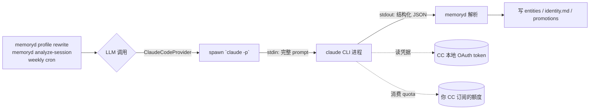

# 复用 Claude Code 当 LLM —— 零额外成本

memoryd 的"自动学习画像"功能需要调 LLM。如果你已经在用 **Claude Code**（CC）订阅，可以**直接复用** CC 的 quota，不用买 API key，不用本地跑 Ollama。

## 它到底怎么个复用？（原理）



每次 memoryd 要调 LLM：

1. memoryd 内部 spawn 一个 `claude -p --model <m> --output-format json` 子进程
2. 完整 prompt（system + user messages）通过 stdin pipe 喂给 CC
3. CC 用**你本地已登录的凭据**调 Anthropic API（消耗的是**你 CC 订阅的 quota**，不是 pay-per-token）
4. 输出走 stdout 回 memoryd，结构化 JSON 解析（含 `--output-format json`）
5. 进程退出，下次再 spawn 新的

## 用户需要做什么（前置条件）

只要这 3 件事就齐了 —— **不需要 API key、不需要登录、不需要改任何 token**：

| 前置 | 怎么检查 | 没满足怎么办 |
|---|---|---|
| 1. Claude Code CLI 已装 | `which claude` 有路径输出 | 装 CC（[官方安装](https://docs.claude.com/en/docs/claude-code)） |
| 2. CC 已经登录过 | `claude -p "OK"` 不要交互登录就能 print 一行回复 | 跑 `claude` 一次进 OAuth 完成登录 |
| 3. memoryd provider 已切到 claude-code | `memoryd config show \| grep provider` 看到 `claude-code` | `memoryd config set llm.provider claude-code` |

> 装 memoryd 时 `memoryd setup auto-install` **自动**检测 `which claude` 在 PATH，把 provider 自动切到 claude-code 当默认值。完全不用手动做这一步。

## 验证一遍通路（30 秒）

```bash
memoryd llm test
```

预期输出：

```
provider: claude-code
model:    claude-haiku-4-5
latency:  7.07s
reply:    'OK'
OK: provider returned the expected token.
```

`reply: 'OK'` = CC 真的应答了。failure 时 print 清晰错误（找不到 claude / OAuth 没登录 / quota 超 / 网络），按提示修。

## 实测耗时与成本

| 单次调用 | 耗时（wall clock） | token 消耗（粗估） |
|---|---|---|
| `memoryd llm test`（ping） | ~7s | ~50 tokens（input+output） |
| `analyze-session`（单个 session 抽实体 + DURA） | ~10-15s | ~2000-5000 tokens |
| `profile rewrite`（重写 identity.md） | ~15-25s | ~3000-8000 tokens |
| `backfill --limit=50`（批量补历史） | ~8-10 分钟 | ~150K tokens 合计 |
| 每周 cron 自动 weekly_identity | ~20s | ~5000 tokens |
| 每月 cron 自动 monthly_report | ~30s | ~8000 tokens |

**月度总消耗（一个活跃用户）**：约 5-15K tokens，约等于 CC 订阅几分钟普通使用。**不会让你订阅吃紧**。

> Wall-clock 主要是 claude CLI 冷启动 + LLM 推理。冷启动 ~3-5 秒固定开销 + 输出长度成正比。

## 跟其他 provider 对比

| provider | 成本 | 配置 | 离线可用 | 推荐场景 |
|---|---|---|---|---|
| **claude-code** ⭐ | $0（用 CC 订阅） | 0 配置 | 否（需要联网调 Anthropic） | 已经在付 CC 订阅 |
| `anthropic` | 按 token 付（haiku ~$0.0008/K） | `export ANTHROPIC_API_KEY=...` | 否 | API 用户、自动化脚本 |
| `openai` | 按 token 付（gpt-4o-mini ~$0.00015/K） | `export OPENAI_API_KEY=...` | 否 | 偏好 OpenAI 生态 |
| `ollama` | $0（本地算力） | 装 ollama + 跑模型 | **是** | 离线 / 完全私有 / 不想付钱 |

切换 provider：

```bash
memoryd config set llm.provider claude-code   # 推荐
memoryd config set llm.provider anthropic     # API key 路径
memoryd config set llm.provider ollama        # 完全本地
```

## 这条路径下，"我"啥时候会感受到 LLM 在跑？

| 场景 | 感受 |
|---|---|
| 你写代码 / 聊天 (CC / Codex / OpenClaw) | 完全无感 —— LLM 不在这一步介入；memoryd 只是后台 capture |
| 周一凌晨 02:00 | 看不见（cron `weekly_identity` 后台跑 ~20s） |
| 每月 1 号凌晨 04:00 | 看不见（cron `monthly_report` 后台跑 ~30s） |
| 手动跑 `memoryd profile rewrite` | 等 ~20s，CLI 直接 print 进度 |
| 手动跑 `memoryd backfill` | 看到每条 session 实时进度 + ETA |
| CC 调 `mem_judge` / `mem_compare` MCP 工具 | CC 自己等 ~10s，你能在 CC 里看到工具调用 |

memoryd capture / search / list / show 等**最常用的命令完全不调 LLM**，跑这些的时候 CC 订阅 quota **零消耗**。

## 故障排查

### `memoryd llm test` 报 "claude CLI not found"

```bash
which claude
# 找不到 → 装 CC，或者设环境变量：
export MEMORYD_CLAUDE_BIN=/path/to/claude
```

### 实测 `claude -p` 卡住要登录

第一次跑 CC 需要走 OAuth。直接跑一次 `claude` 进交互模式完成登录即可，之后 `-p` 模式就能用。

### 输出含 "is_error: true" / "context window exceeded"

session 内容太长。memoryd 内部已经把 prompt 截到 8000 字符，但极长 session 仍可能溢出。看 `~/.local/share/memoryd/logs/` 找具体哪条 session 触发。

### CC quota 不够想换 provider

```bash
export ANTHROPIC_API_KEY=sk-ant-...
memoryd config set llm.provider anthropic
memoryd llm test   # 验证新通路
```

下一次 cron 会用新 provider。

### 想完全本地（不联网）

```bash
ollama serve &
ollama pull qwen2.5:7b
memoryd config set llm.provider ollama
memoryd config set llm.model qwen2.5:7b
memoryd llm test
```

注意 7B 本地模型 entity 抽取质量明显低于 Claude，画像 rewrite 会变啰嗦。仅作为离线兜底。

## 内部实现链路

源码：

- [memoryd/src/memoryd/llm/claude_code_provider.py](https://github.com/EthanQC/memory-system/blob/main/memoryd/src/memoryd/llm/claude_code_provider.py) —— spawn + parse
- [memoryd/src/memoryd/llm/factory.py](https://github.com/EthanQC/memory-system/blob/main/memoryd/src/memoryd/llm/factory.py) —— provider 工厂
- [memoryd/src/memoryd/llm/__init__.py](https://github.com/EthanQC/memory-system/blob/main/memoryd/src/memoryd/llm/__init__.py) —— legacy sync `complete()` 兼容入口

ClaudeCodeProvider 同时实现两种 protocol：

- `async generate / generate_json`（新 API，profile 用）
- `sync complete(system, user)`（旧 API，governance/analyze 用）

`generate_json` 自动解析 CC `--output-format=json` 信封（`{"type":"result", "result":"..."}` → 提取 `result` 字段），再做 markdown 围栏剥离做兜底。
